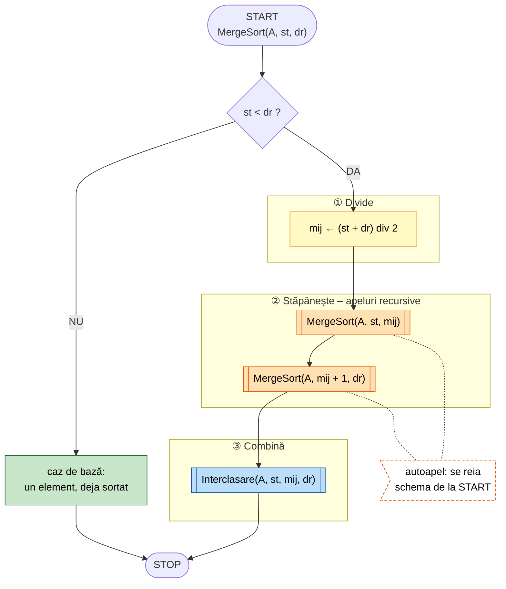
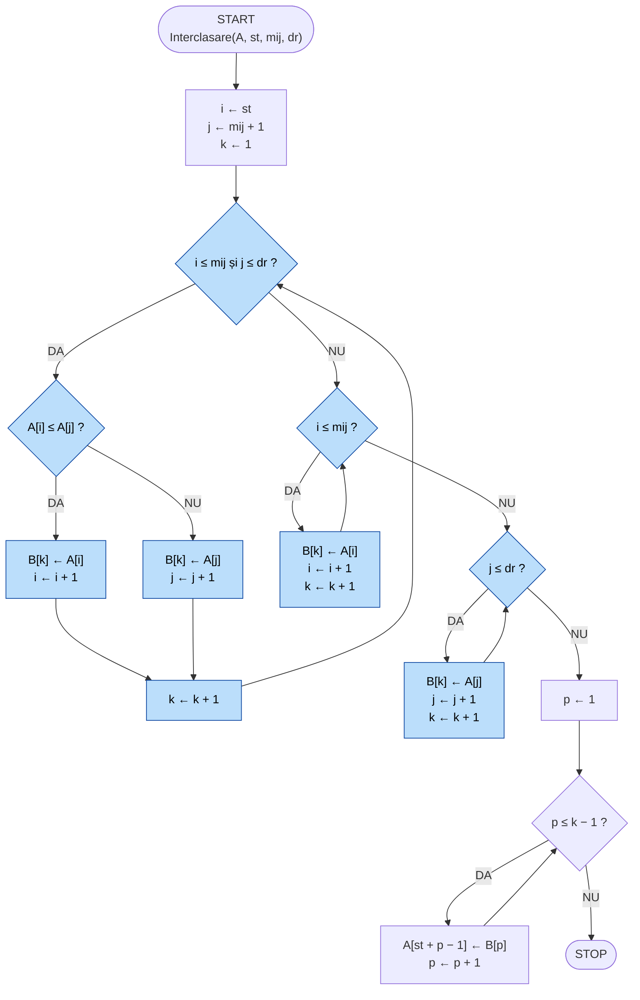

# Merge Sort (sortare prin interclasare)

**Inginerie Software** – Proiectați algoritmul Merge Sort și reprezentați-l prin pseudocod și schemă logică,
evidențiind etapele recursive și procesul de interclasare.

Merge Sort folosește metoda **Divide et Impera**:

1. **Divide** – secvența `A[st..dr]` se împarte în două jumătăți, la mijlocul `mij = (st + dr) div 2`;
2. **Stăpânește** – fiecare jumătate se sortează **recursiv**; recursivitatea se oprește când secvența
   are un singur element (`st = dr`);
3. **Combină** – cele două jumătăți sortate se **interclasează** într-o singură secvență sortată.

## Pseudocod

```text
subalgoritm MergeSort(A, st, dr)
    dacă st < dr atunci
        mij ← (st + dr) div 2              // divide
        MergeSort(A, st, mij)              // apel recursiv – jumătatea stângă
        MergeSort(A, mij + 1, dr)          // apel recursiv – jumătatea dreaptă
        Interclasare(A, st, mij, dr)       // combină
    sfârșit dacă                           // altfel: un element, deja sortat
sfârșit subalgoritm

subalgoritm Interclasare(A, st, mij, dr)
    i ← st;  j ← mij + 1;  k ← 1
    cât timp i ≤ mij și j ≤ dr execută
        dacă A[i] ≤ A[j] atunci
            B[k] ← A[i];  i ← i + 1
        altfel
            B[k] ← A[j];  j ← j + 1
        sfârșit dacă
        k ← k + 1
    sfârșit cât timp
    cât timp i ≤ mij execută               // ce a rămas în stânga
        B[k] ← A[i];  i ← i + 1;  k ← k + 1
    sfârșit cât timp
    cât timp j ≤ dr execută                // ce a rămas în dreapta
        B[k] ← A[j];  j ← j + 1;  k ← k + 1
    sfârșit cât timp
    pentru p ← 1, k − 1 execută            // copiere înapoi în A
        A[st + p − 1] ← B[p]
    sfârșit pentru
sfârșit subalgoritm
```

Apel inițial: `MergeSort(A, 1, n)`.

Exemplu:

```text
38 27 43 3  →  38 27 | 43 3  →  38 | 27 | 43 | 3       (divizare, apeluri recursive)
            →  27 38 | 3 43  →  3 27 38 43             (interclasare, la revenire)
```

## Schema logică

Portocaliu – apeluri recursive, albastru – interclasare, verde – cazul de bază.




