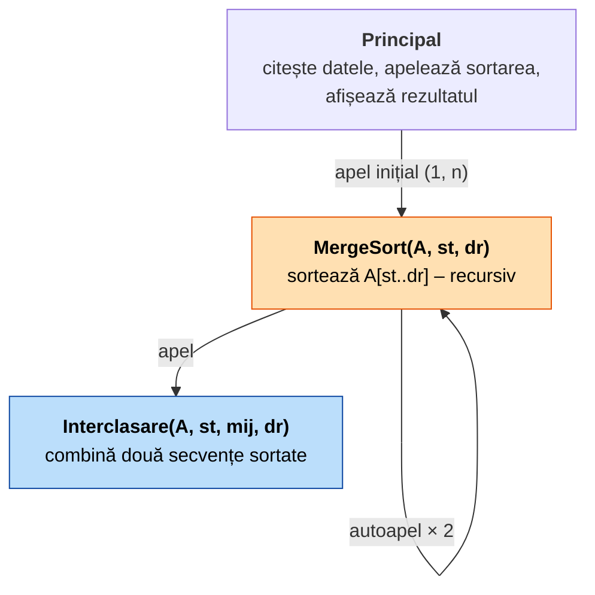
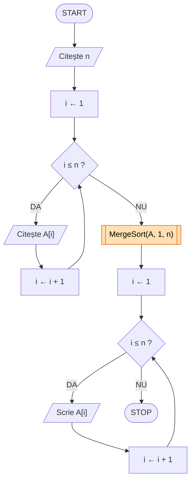
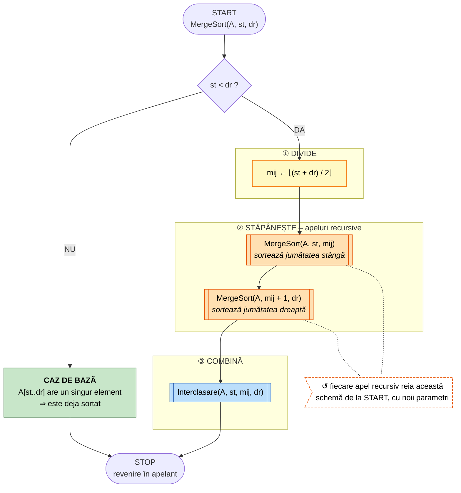
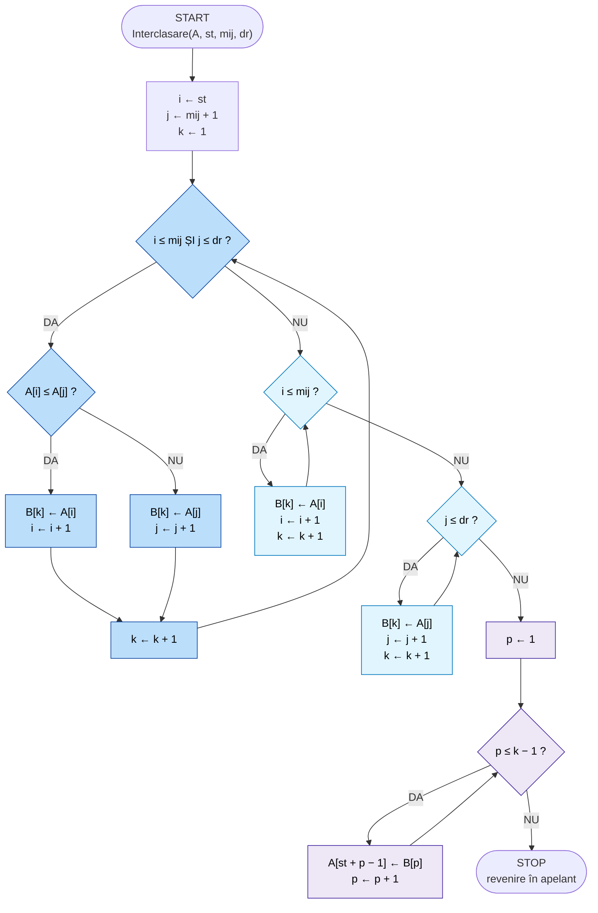
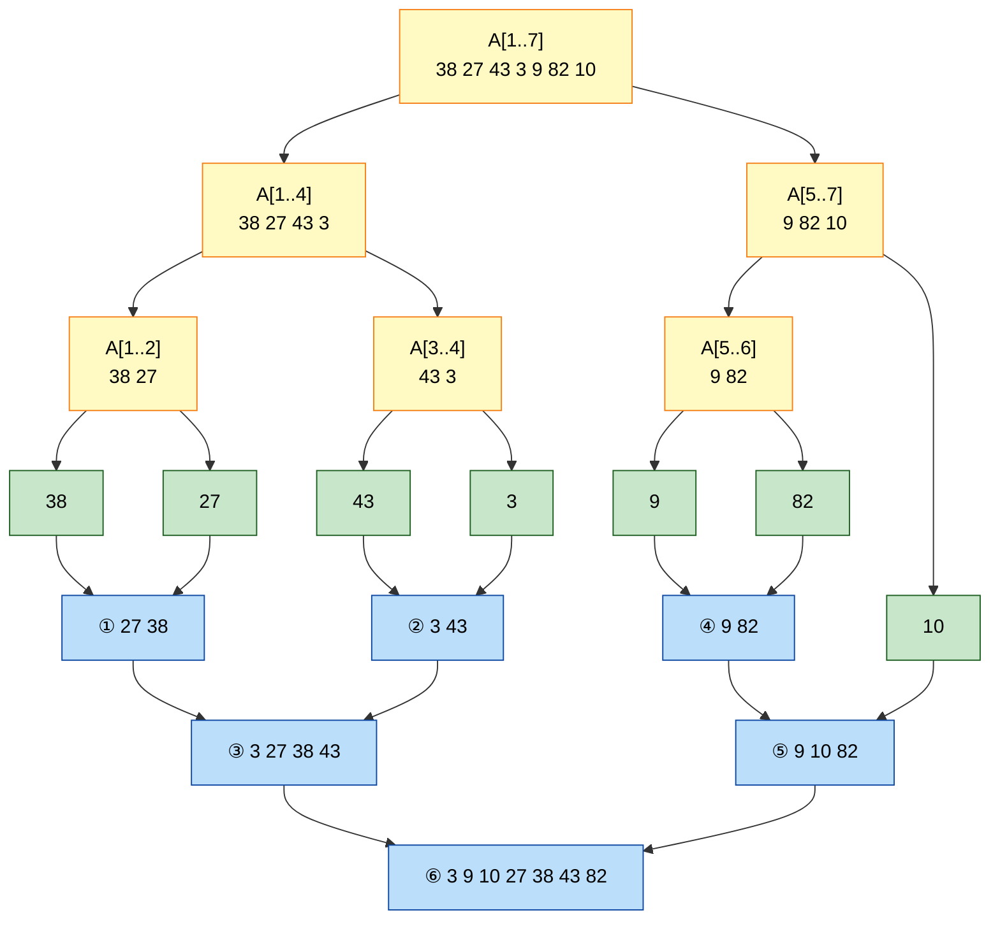

# Merge Sort – sortare prin interclasare

**Disciplina:** Inginerie Software

**Cerința:** Proiectați algoritmul Merge Sort și reprezentați-l prin pseudocod și schemă logică,
evidențiind etapele recursive și procesul de interclasare.

---

## Cuprins

1. [Specificarea problemei](#1-specificarea-problemei)
2. [Strategia de proiectare: Divide et Impera](#2-strategia-de-proiectare-divide-et-impera)
3. [Descompunerea modulară](#3-descompunerea-modulară)
4. [Pseudocod](#4-pseudocod)
5. [Scheme logice](#5-scheme-logice)
6. [Exemplu de execuție](#6-exemplu-de-execuție)
7. [Corectitudine](#7-corectitudine)
8. [Analiza complexității](#8-analiza-complexității)
9. [Proprietăți și cazuri de test](#9-proprietăți-și-cazuri-de-test)
10. [Fișierele din acest folder](#10-fișierele-din-acest-folder)

---

## 1. Specificarea problemei

| Element         | Descriere                                                                                       |
|-----------------|-------------------------------------------------------------------------------------------------|
| Date de intrare | `n` – număr natural, `n ≥ 1`; `A[1..n]` – tablou de `n` elemente comparabile (de ex. numere întregi) |
| Date de ieșire  | tabloul `A[1..n]` cu aceleași elemente, ordonate crescător                                       |
| Precondiție     | între elementele lui `A` este definită o relație de ordine totală `≤`                           |
| Postcondiție    | `A[1] ≤ A[2] ≤ … ≤ A[n]` și `A` este o permutare a tabloului inițial                            |

## 2. Strategia de proiectare: Divide et Impera

Merge Sort aplică metoda **Divide et Impera**. Pentru o subsecvență `A[st..dr]` se parcurg trei etape:

| Etapa | Ce se face | Unde apare în algoritm |
|-------|------------|------------------------|
| **① DIVIDE** | se calculează mijlocul `mij = ⌊(st + dr) / 2⌋` și secvența se împarte în `A[st..mij]` și `A[mij+1..dr]` | `MergeSort`, o atribuire |
| **② STĂPÂNEȘTE** (etapa recursivă) | fiecare jumătate se sortează **prin același algoritm**, apelat recursiv | `MergeSort`, două autoapeluri |
| **③ COMBINĂ** (interclasarea) | cele două jumătăți, acum sortate, se **interclasează** într-o singură secvență sortată | subprogramul `Interclasare` |

**Cazul de bază** (condiția de oprire a recursivității): o secvență cu un singur element (`st = dr`) este
deja sortată, deci nu se mai face nimic.

Ideea pe scurt: împărțirea continuă până la secvențe de un element, apoi la revenirea din apeluri
secvențele sortate se interclasează două câte două, tot mai mari, până se refac tot tabloul.

## 3. Descompunerea modulară



| Modul | Parametri | Rol |
|-------|-----------|-----|
| `Principal` | – | citește `n` și `A[1..n]`, apelează `MergeSort(A, 1, n)`, afișează `A` |
| `MergeSort` | `A` (intrare/ieșire), `st`, `dr` (intrare) | sortează crescător `A[st..dr]`; este **recursiv** |
| `Interclasare` | `A` (intrare/ieșire), `st`, `mij`, `dr` (intrare) | știind că `A[st..mij]` și `A[mij+1..dr]` sunt sortate, le combină astfel încât `A[st..dr]` să fie sortat |

## 4. Pseudocod

### 4.1 Programul principal

```text
ALGORITM Principal
    CITEȘTE n
    PENTRU i ← 1, n EXECUTĂ
        CITEȘTE A[i]
    SFÂRȘIT PENTRU

    MergeSort(A, 1, n)                      ▷ apelul inițial: tot tabloul

    PENTRU i ← 1, n EXECUTĂ
        SCRIE A[i]
    SFÂRȘIT PENTRU
SFÂRȘIT ALGORITM
```

### 4.2 Subprogramul recursiv `MergeSort`

```text
SUBPROGRAM MergeSort(A, st, dr)
    ▷ sortează crescător subsecvența A[st..dr]

    DACĂ st < dr ATUNCI                     ▷ secvența are cel puțin 2 elemente
        ▷ ① DIVIDE
        mij ← ⌊(st + dr) / 2⌋

        ▷ ② STĂPÂNEȘTE – apeluri recursive
        MergeSort(A, st, mij)               ▷ sortează jumătatea stângă
        MergeSort(A, mij + 1, dr)           ▷ sortează jumătatea dreaptă

        ▷ ③ COMBINĂ – interclasare
        Interclasare(A, st, mij, dr)
    SFÂRȘIT DACĂ
    ▷ altfel (st ≥ dr): CAZ DE BAZĂ – un singur element, deja sortat; nu se face nimic
SFÂRȘIT SUBPROGRAM
```

### 4.3 Subprogramul `Interclasare`

```text
SUBPROGRAM Interclasare(A, st, mij, dr)
    ▷ precondiție:  A[st..mij] și A[mij+1..dr] sunt sortate crescător
    ▷ postcondiție: A[st..dr] este sortat crescător
    ▷ B[1..dr − st + 1] – tablou auxiliar

    i ← st                                  ▷ parcurge jumătatea stângă
    j ← mij + 1                             ▷ parcurge jumătatea dreaptă
    k ← 1                                   ▷ prima poziție liberă din B

    ▷ (a) cât timp ambele jumătăți au elemente, se copiază în B minimul dintre A[i] și A[j]
    CÂT TIMP i ≤ mij ȘI j ≤ dr EXECUTĂ
        DACĂ A[i] ≤ A[j] ATUNCI             ▷ „≤” (nu „<”) face sortarea stabilă
            B[k] ← A[i]
            i ← i + 1
        ALTFEL
            B[k] ← A[j]
            j ← j + 1
        SFÂRȘIT DACĂ
        k ← k + 1
    SFÂRȘIT CÂT TIMP

    ▷ (b) se copiază elementele rămase în jumătatea stângă (dacă există)
    CÂT TIMP i ≤ mij EXECUTĂ
        B[k] ← A[i]
        i ← i + 1
        k ← k + 1
    SFÂRȘIT CÂT TIMP

    ▷ (c) se copiază elementele rămase în jumătatea dreaptă (dacă există)
    CÂT TIMP j ≤ dr EXECUTĂ
        B[k] ← A[j]
        j ← j + 1
        k ← k + 1
    SFÂRȘIT CÂT TIMP

    ▷ (d) rezultatul se copiază înapoi în A[st..dr]
    PENTRU p ← 1, k − 1 EXECUTĂ
        A[st + p − 1] ← B[p]
    SFÂRȘIT PENTRU
SFÂRȘIT SUBPROGRAM
```

Observație: după bucla (a), cel puțin una dintre jumătăți este epuizată, deci se execută **cel mult una**
dintre buclele (b) și (c).

## 5. Scheme logice

**Legenda simbolurilor**

| Simbol | Semnificație |
|--------|--------------|
| bloc oval (terminal) | START / STOP (pentru subprograme: intrare / revenire în apelant) |
| paralelogram | citire / scriere (intrare / ieșire) |
| dreptunghi | atribuire / prelucrare |
| romb | decizie (condiție cu ramurile DA / NU) |
| dreptunghi cu bare laterale | apel de subprogram |

**Culori folosite pentru evidențiere:**
🟨 galben – etapa DIVIDE · 🟧 portocaliu – **apeluri recursive** (STĂPÂNEȘTE) ·
🟦 albastru – **interclasare** (COMBINĂ) · 🟩 verde – **cazul de bază** (oprirea recursivității)

### 5.1 Schema logică – programul principal



### 5.2 Schema logică – `MergeSort(A, st, dr)` (etapele recursive)



Blocurile portocalii sunt **autoapeluri**: fiecare reintră în aceeași schemă de la START, cu alți
parametri. Execuția apelantului continuă cu blocul următor abia după ce apelul recursiv ajunge la STOP.

### 5.3 Schema logică – `Interclasare(A, st, mij, dr)` (procesul de interclasare)



Cele patru zone ale schemei corespund pașilor din pseudocod:
(a) **comparare și copiere** a celui mai mic element (albastru închis),
(b)–(c) **copierea restului** din jumătatea neepuizată (albastru deschis),
(d) **copierea înapoi** din `B` în `A` (mov).

## 6. Exemplu de execuție

Tablou: `A = [38, 27, 43, 3, 9, 82, 10]`, `n = 7`, apel inițial `MergeSort(A, 1, 7)`.

### 6.1 Arborele recursivității

Partea de sus (🟨) este **etapa de divizare**, frunzele (🟩) sunt **cazurile de bază**, iar partea de jos
(🟦) este **etapa de interclasare**. Numerele ①–⑥ dau ordinea în care se execută interclasările.



### 6.2 Ordinea reală a apelurilor

Indentarea arată adâncimea recursivității. Se observă că o interclasare se face abia după ce **ambele**
apeluri recursive pentru jumătățile ei s-au terminat (ieșire generată de `merge_sort.py`):

```text
MergeSort(A, 1, 7)  [38, 27, 43, 3, 9, 82, 10]
    MergeSort(A, 1, 4)  [38, 27, 43, 3]
        MergeSort(A, 1, 2)  [38, 27]
            MergeSort(A, 1, 1)  [38]  -> caz de baza
            MergeSort(A, 2, 2)  [27]  -> caz de baza
            Interclasare(A, 1, 1, 2)  [38] + [27] -> [27, 38]
        MergeSort(A, 3, 4)  [43, 3]
            MergeSort(A, 3, 3)  [43]  -> caz de baza
            MergeSort(A, 4, 4)  [3]  -> caz de baza
            Interclasare(A, 3, 3, 4)  [43] + [3] -> [3, 43]
        Interclasare(A, 1, 2, 4)  [27, 38] + [3, 43] -> [3, 27, 38, 43]
    MergeSort(A, 5, 7)  [9, 82, 10]
        MergeSort(A, 5, 6)  [9, 82]
            MergeSort(A, 5, 5)  [9]  -> caz de baza
            MergeSort(A, 6, 6)  [82]  -> caz de baza
            Interclasare(A, 5, 5, 6)  [9] + [82] -> [9, 82]
        MergeSort(A, 7, 7)  [10]  -> caz de baza
        Interclasare(A, 5, 6, 7)  [9, 82] + [10] -> [9, 10, 82]
    Interclasare(A, 1, 4, 7)  [3, 27, 38, 43] + [9, 10, 82] -> [3, 9, 10, 27, 38, 43, 82]
```

În total: 13 apeluri `MergeSort` (7 cazuri de bază + 6 cu divizare), 6 interclasări, adâncime maximă 3.

### 6.3 Interclasarea finală, pas cu pas

Apelul `Interclasare(A, 1, 4, 7)`, cu `A = [3, 27, 38, 43 | 9, 10, 82]`
(jumătatea stângă `A[1..4]`, jumătatea dreaptă `A[5..7]`):

| Pas | `i` | `A[i]` | `j` | `A[j]` | Test `A[i] ≤ A[j]` | Se copiază în `B[k]` | `B` după pas |
|:---:|:---:|:------:|:---:|:------:|:------------------:|:--------------------:|:-------------|
| 1 | 1 | 3  | 5 | 9  | DA | 3  (`i ← 2`) | 3 |
| 2 | 2 | 27 | 5 | 9  | NU | 9  (`j ← 6`) | 3 9 |
| 3 | 2 | 27 | 6 | 10 | NU | 10 (`j ← 7`) | 3 9 10 |
| 4 | 2 | 27 | 7 | 82 | DA | 27 (`i ← 3`) | 3 9 10 27 |
| 5 | 3 | 38 | 7 | 82 | DA | 38 (`i ← 4`) | 3 9 10 27 38 |
| 6 | 4 | 43 | 7 | 82 | DA | 43 (`i ← 5`) | 3 9 10 27 38 43 |
| – | 5 | –  | 7 | 82 | `i > mij`: bucla (a) se oprește | | |
| 7 | – | –  | 7 | 82 | bucla (c): rest dreapta | 82 (`j ← 8`) | 3 9 10 27 38 43 82 |

La final, bucla (d) copiază `B[1..7]` în `A[1..7]`, deci `A = [3, 9, 10, 27, 38, 43, 82]`.
S-au făcut 6 comparații și 7 copieri în `B`.

## 7. Corectitudine

**Interclasare.** La fiecare reluare a buclei (a) este adevărat **invariantul**:
`B[1..k−1]` conține, în ordine crescătoare, elementele `A[st..i−1]` și `A[mij+1..j−1]`, iar acestea sunt
cele mai mici `k − 1` elemente din cele două jumătăți.
- *Inițializare:* `k = 1`, `B` este vid – adevărat.
- *Menținere:* `A[i]` și `A[j]` sunt cele mai mici elemente necopiate din jumătățile lor (jumătățile sunt
  sortate), deci `min(A[i], A[j])` este cel mai mic element necopiat; adăugat la sfârșitul lui `B`, păstrează
  `B` sortat.
- *Terminare:* la fiecare pas crește `i` sau `j`, deci bucla se oprește. Buclele (b)/(c) adaugă restul unei
  singure jumătăți, deja sortat și mai mare sau egal cu tot ce e în `B`. Rezultă `B` sortat, cu toate cele
  `dr − st + 1` elemente.

**MergeSort** – prin inducție după lungimea `m = dr − st + 1`:
- *Caz de bază:* `m ≤ 1` – secvența este sortată, algoritmul nu o modifică.
- *Pas de inducție:* pentru `m ≥ 2`, `st ≤ mij < dr`, deci ambele jumătăți au lungime strict mai mică
  decât `m` (`⌈m/2⌉` și `⌊m/2⌋`). Din ipoteza de inducție ele ies sortate, iar `Interclasare` le combină corect.
- *Terminare:* lungimea scade strict la fiecare autoapel, deci se ajunge mereu la cazul de bază.

## 8. Analiza complexității

**Recurența timpului de execuție** (`c` – constantă):

```text
T(1) = c
T(n) = T(⌈n/2⌉) + T(⌊n/2⌋) + c·n        pentru n ≥ 2
         └── două apeluri recursive ──┘   └ interclasare ┘
```

Cu Teorema Master (`a = 2`, `b = 2`, `f(n) = Θ(n) = Θ(n^(log₂2))`, cazul 2): **`T(n) = Θ(n log n)`**.

Intuitiv, din arborele recursivității: sunt `⌈log₂ n⌉` niveluri de divizare, iar pe fiecare nivel
interclasările prelucrează în total cel mult `n` elemente ⇒ `n · log₂ n` operații.

| Caracteristică | Valoare |
|----------------|---------|
| Timp – caz favorabil / mediu / defavorabil | `Θ(n log n)` / `Θ(n log n)` / `Θ(n log n)` |
| Comparații într-o interclasare de lungimi `n₁` și `n₂` | între `min(n₁, n₂)` și `n₁ + n₂ − 1` |
| Număr de apeluri `MergeSort` | `2n − 1` (`n` cazuri de bază + `n − 1` divizări) |
| Număr de interclasări | `n − 1` |
| Adâncimea recursivității | `⌈log₂ n⌉` |
| Memorie suplimentară | `Θ(n)` pentru tabloul `B` + `Θ(log n)` pentru stiva de apeluri |

## 9. Proprietăți și cazuri de test

**Proprietăți**
- **Stabil:** elementele egale își păstrează ordinea relativă, datorită testului `A[i] ≤ A[j]`
  (la egalitate se ia elementul din stânga).
- **Nu sortează „pe loc”:** are nevoie de tabloul auxiliar `B`.
- **Predictibil:** timpul este `Θ(n log n)` indiferent de ordinea inițială a datelor.
- Potrivit pentru liste înlănțuite și pentru sortarea externă (date care nu încap în memorie).

**Cazuri de test** (verificate automat în `merge_sort.py --test`)

| Caz | Intrare | Ieșire așteptată |
|-----|---------|------------------|
| un element (doar cazul de bază) | `7` | `7` |
| două elemente inversate | `2 1` | `1 2` |
| tablou deja sortat | `1 2 3 4` | `1 2 3 4` |
| tablou sortat descrescător | `4 3 2 1` | `1 2 3 4` |
| elemente egale | `5 5 5` | `5 5 5` |
| exemplul din secțiunea 6 | `38 27 43 3 9 82 10` | `3 9 10 27 38 43 82` |
| stabilitate (cheie, etichetă) | `(2,a) (1,b) (2,c) (1,d)` | `(1,b) (1,d) (2,a) (2,c)` |
| 2000 de tablouri aleatoare | – | identic cu `sorted()` din Python |

## 10. Fișierele din acest folder

| Fișier | Conținut |
|--------|----------|
| `README.md` | acest document: proiectare, pseudocod, scheme logice, exemplu, analiză |
| `merge-sort.pdf` | același document în format PDF (A4), gata de predat |
| `diagrame/` | diagramele de mai sus exportate ca imagini PNG, pentru tipărire sau inserare în Word |
| `merge_sort.py` | implementare care urmează pseudocodul linie cu linie (indici de la 1), cu trasarea apelurilor și teste |

```bash
python3 merge_sort.py                  # rulează exemplul din secțiunea 6, cu trasare
python3 merge_sort.py 5 2 9 1 7        # trasare pentru un tablou propriu
python3 merge_sort.py --test           # rulează cazurile de test
```
